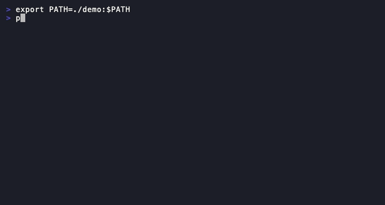
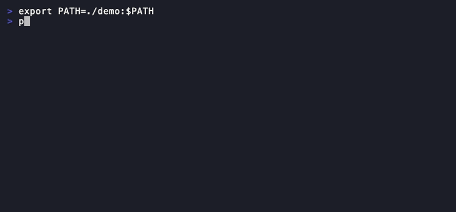
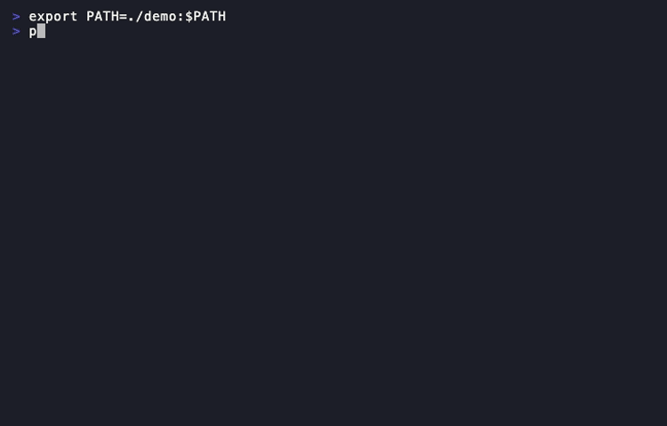

# pie

Self-hosted, encrypted tunnel to expose localhost to the internet. Built for webhook development, Telegram mini-apps, and async AI pipelines.

One command to get a public HTTPS URL for your local server:



## Why pie?

- **End-to-end encrypted** — Noise NK protocol. Your server never sees plaintext data.
- **Self-hosted** — run on your own VPS. No vendor lock-in, no third-party traffic inspection.
- **Fast** — 577 req/s parallel throughput, 2ms latency overhead. Protobuf + zstd + yamux.
- **Pipeline debugger** — trace async AI webhook chains (Replicate, fal.ai, RunPod) with timeline visualization.
- **Web dashboard** — inspect requests, replay webhooks, view pipeline traces.
- **Zero-config start** — `pie setup` on server, `pie login` on client, done.

## Quick Start

### Server (your VPS, one time)

```bash
# Install
curl -sSL https://pipepie.dev/install | sh

# Interactive setup — handles DNS, firewall, TLS, everything
pie setup
```

`pie setup` walks you through domain configuration, DNS verification, TLS certificates (Cloudflare auto or manual), firewall rules, nginx detection, systemd service creation, and server key generation.

### Client (your dev machine)

```bash
# Save the server connection (key from pie setup output)
pie login --server tunnel.mysite.com:9443 --key a7f3bc21...

# Tunnel any local port
pie connect 3000
```

That's it. Your local server is now reachable at `https://abc123.tunnel.mysite.com`.

## Features

### Tunneling

```bash
# HTTP tunnel
pie connect 3000

# Named subdomain
pie connect 3000 --name my-app

# TCP tunnel (databases, gRPC)
pie connect --tcp 5432

# Protect with password
pie connect 3000 --auth secretpass

# Multiple tunnels from config
pie up
```

### Inspection



```bash
# Web dashboard (opens browser, auto-authenticated)
pie dashboard

# Stream requests in terminal with bodies
pie logs my-app --follow --body

# Show tunnel status
pie status
```



### Pipeline Tracing

Trace async AI webhook chains. Send webhooks with trace headers:

```bash
curl -X POST https://my-app.tunnel.mysite.com/replicate \
  -H "X-Pipepie-Trace-ID: trace-001" \
  -H "X-Pipepie-Pipeline: image-gen" \
  -H "X-Pipepie-Step: generate"
```

View the full pipeline timeline in the web dashboard — which step ran, how long it took, what failed.

### Multi-Service Config

Create `pipepie.yaml` in your project:

```yaml
server: tunnel.mysite.com:9443
key: a7f3bc21...

tunnels:
  api:
    subdomain: my-api
    forward: http://localhost:3000
  frontend:
    subdomain: my-app
    port: 5173

pipeline:
  name: image-gen
  steps:
    - name: replicate-sdxl
      webhook: /replicate
      forward: localhost:3000/on-image
    - name: fal-upscale
      webhook: /fal
      forward: localhost:3000/on-upscale
```

```bash
pie up
```

### Multi-Account

```bash
# Add multiple servers
pie login --server work.example.com:9443 --key abc...
pie login --server personal.example.com:9443 --key def...

# Switch between them
pie account
pie account use work.example.com

# Remove
pie logout personal.example.com
```

## Architecture

```
Client (pie connect)                    Server (pie server)
     │                                       │
     │◄──── Noise NK handshake ────►│
     │       (ChaChaPoly + BLAKE2b)          │
     │                                       │
     │◄──── yamux multiplexing ────►│
     │       (parallel streams)              │
     │                                       │
     │◄──── Protobuf + zstd ──────►│
     │       (binary, compressed)            │
     │                                       │
  localhost:3000              https://sub.domain.com
```

- **Noise NK** — client authenticates server by public key. Know the key = have access.
- **yamux** — multiplexed streams over one TCP connection. No head-of-line blocking.
- **Protobuf** — binary serialization, ~10x smaller than JSON.
- **zstd** — bodies >1KB auto-compressed.
- **SQLite WAL** — request history, zero config.

## CLI Reference

| Command | Description |
|---------|-------------|
| `pie setup` | Interactive server setup wizard |
| `pie server` | Start the relay server |
| `pie doctor` | Diagnose server configuration |
| `pie login` | Add a server connection |
| `pie connect [port]` | Create a tunnel |
| `pie connect --tcp [port]` | TCP tunnel |
| `pie dashboard` | Open web UI in browser |
| `pie status` | Show tunnels and activity |
| `pie logs [name]` | Stream recent requests |
| `pie up` | Multi-tunnel from pipepie.yaml |
| `pie account` | List and switch accounts |
| `pie logout [name]` | Remove an account |

## Server Setup Options

### TLS

```bash
# Automatic wildcard cert via Cloudflare DNS
pie server --auto-tls --config pipepie.yaml

# Manual certificate
pie server --tls-cert /path/to/cert.pem --tls-key /path/to/key.pem

# Behind nginx (pie setup auto-configures)
pie server --addr :8080
```

### Diagnostics

```bash
pie doctor --config pipepie.yaml

#   Config
#   ✓ pipepie.yaml valid
#   ✓ Domain: tunnel.mysite.com
#
#   Network
#   ✓ Port 443 available
#   ✓ Port 9443 available
#
#   DNS
#   ✓ tunnel.mysite.com → 203.0.113.5
#   ✓ *.tunnel.mysite.com → 203.0.113.5
#
#   TLS
#   ✓ Certificate valid, expires in 89 days
```

## Performance

Benchmarked on a single machine (localhost tunnel):

| Metric | Result |
|--------|--------|
| Latency | 2ms overhead |
| Sequential | 119 req/s |
| Parallel (20 workers) | 577 req/s |
| 1MB body | 16ms |

## vs ngrok

| | pie | ngrok |
|---|---|---|
| Self-hosted | ✅ | ❌ |
| Open source | ✅ | ❌ |
| E2E encryption | ✅ Noise NK | ❌ TLS termination |
| Pipeline tracing | ✅ | ❌ |
| Request inspection | ✅ | ✅ (paid) |
| Replay | ✅ | ✅ (paid) |
| TCP tunnels | ✅ | ✅ |
| Custom domains | ✅ | ✅ (paid) |
| WebSocket | ✅ | ✅ |
| Setup wizard | ✅ | N/A |
| Price | Free | $8-39/mo |

## Build from Source

```bash
git clone https://github.com/Seinarukiro2/pipepie
cd pipepie
make build    # → ./pie
make test     # run tests
make release  # cross-compile all platforms
```

Requires Go 1.21+.

## License

AGPL-3.0 — free to use, modify, and self-host. If you modify and offer as a service, you must open-source your changes.
